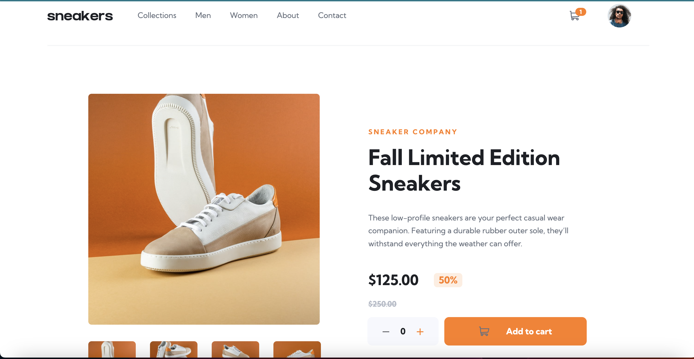
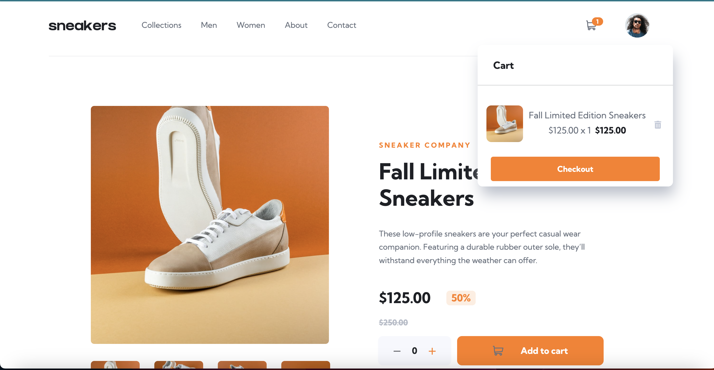
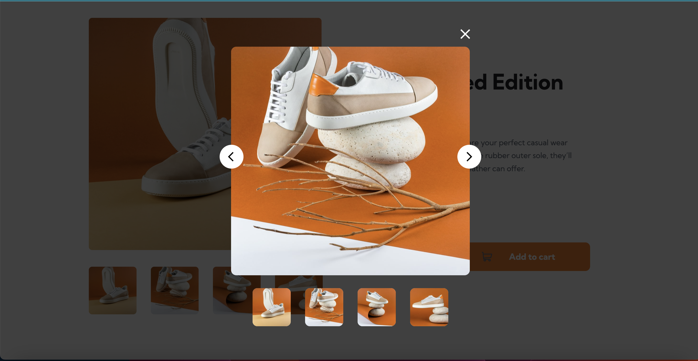
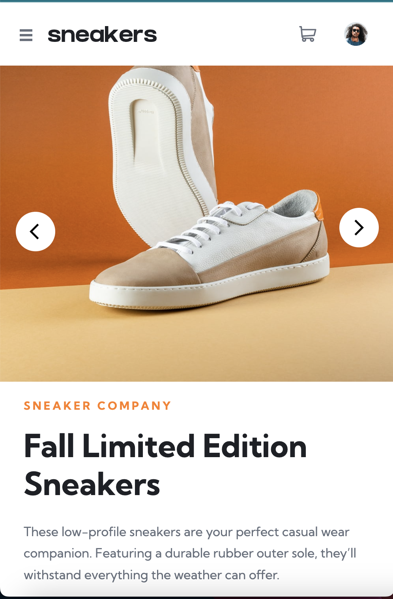
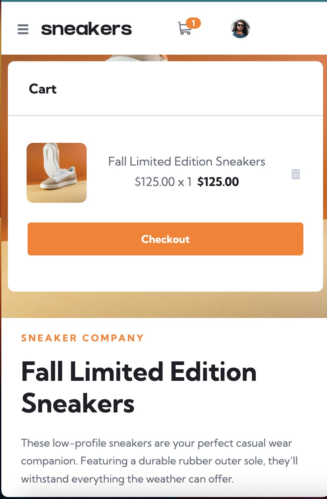
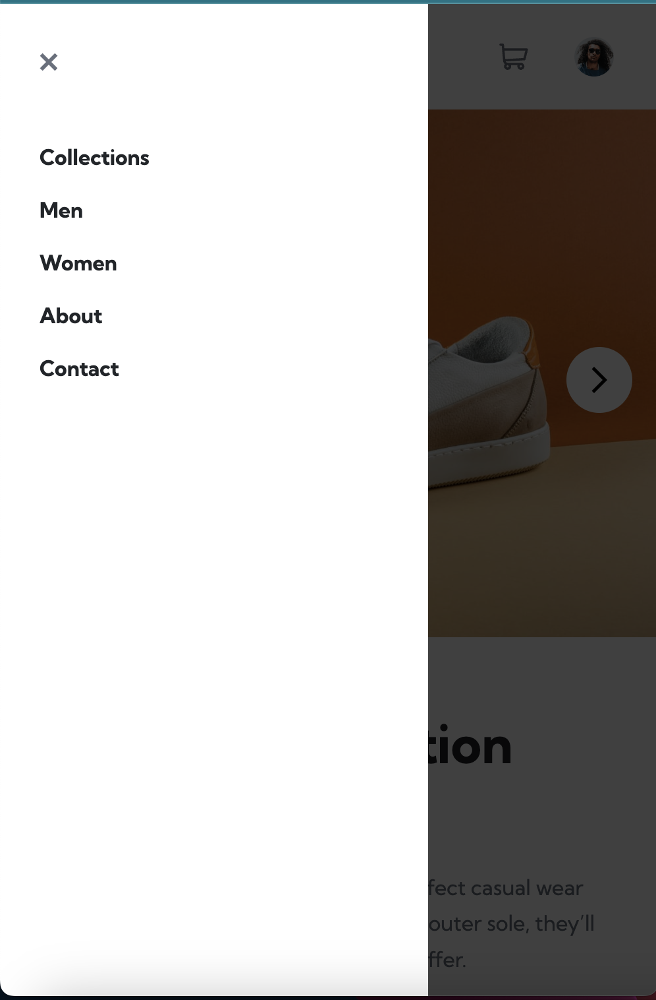

# Learning People Global - E-commerce product page solution

This Project presents my third and final project with my Front-end Web Development
course with Learning People Global.
This is a solution to the [E-commerce product page challenge on Frontend Mentor](https://www.frontendmentor.io/challenges/ecommerce-product-page-UPsZ9MJp6).
The purpose of the solution is to present "Put all together" Front-end web development 
project using JavaScript UI Library.
The solution itself is an e-commerce website SNEAKERS.

## Table of contents

- [Overview](#overview)
  - [The challenge](#the-challenge)
  - [Screenshot](#screenshot)
  - [Links](#links)
- [My Solution](#my-solution)
  - [Built with technologies](#built-with-technologies)
  - [What I learned](#what-i-learned)
  - [Errors and Bugs](#errors-and-bugs)
- [Deployment](#deployment)
- [Author](#author)
- [Acknowledgments](#acknowledgments)

## Overview

### The challenge

Users should be able to:

- View the optimal layout for the site depending on their device's screen size
- See hover states for all interactive elements on the page
- Open a lightbox gallery by clicking on the large product image
  - for the time being lightbox gallery is open by clicking on the thumbnails
- Switch the large product image by clicking on the small thumbnail images
  - Working in progress
- Add items to the cart
- View the cart and remove items from it

### Screenshot

#### Desktop version


#### Checkout modal


#### Lightbox gallery


#### Mobile version


#### Checkout modal mobile


#### Offcanvas menu


### Links to a repository and live site

- [GitHub](https://github.com/NDraganov/sneakers-react-app)
- [Live site](https://ndraganov.github.io/sneakers-react-app/)

## My Solution

### Built with technologies

- [JSX](https://reactjs.org/docs/introducing-jsx.html) - for rendering
- [CSS](https://www.w3.org/Style/CSS/Overview.en.html) with media query - for styles 
- [Bootstrap](https://getbootstrap.com) - for responsiveness
- [React](https://reactjs.org/) - JS library
- [MUI](https://mui.com) -  React component library used for buttons icons

### What I learned

* React basics - some of it: creating reusable components, useState, useEffect, 
  adding third party libraries
```js
 useEffect(() => {
    const get = JSON.parse(localStorage.getItem("data")) || null;
    setData(get);
  }, [data])
```

* Map method - used for displaying gallery wrap
```js
{galleryImagesSmall &&
    galleryImagesSmall.map((slide, index) => {
    return (
        <div className="single" key={index} onClick={ () => handleOpenModal(index) }>
        
        </div>
    );
    })}
```

* LocalStorage - used to get and set item for cart functionality
```js
  function addCount() {
    const get = JSON.parse(localStorage.getItem('data')) || null;
    localStorage.setItem('data', JSON.stringify(get + count));
    window.location.reload();
  }
```

### Errors and Bugs

* Bootstrap npm package doesn't worked
  - Solution: adding CDN links to index.html in "public" folder
* After installed gh-pages package images not displayed in localhost.
  - Reason: In the newly created "build" folder the paths changed, I haven't 
    used "require()" in source attribute or imported.
  - Solution: I imported the images into the components and where was possible I
    used "require()" in source.
* Safari browser displayed offcanvas without black background when toggle button pressed
  - Bug occurred with the first attempt. When pressed for a second time the background is displayed
  - Solution: Reason and solution not found yet

## Deployment

* Created local project folder - "npm create-react-app"
* Created remote GitHub repository - on GitHub website I created empty repository sneakers-react-app
* Connect local to remote repository - used command line tools with Hyper terminal
  - git init
  - git add.
  - git commit -m "message"
  - git remote add origin "URL"
  - git push -u origin master
* Published the website - used GitHub Pages
  - Installed gh-pages nmp package - "npm install gh-pages --save-dev"
  - Added homepage URL - in package.json ("homepage": "URL")
  - Added properties to script object
    - "predeploy": "npm run build"
    - "deploy": "gh-pages -d build"
  - Published website - "npm run deploy"
* GitHub configurations - when I checked them, they've been set automatically
  - In GitHub remote repository pressed "Settings"
  - On the sitebar pressed "Pages"
  - In "Build and Deployment" => "Source" (Deploy from branch), "Branch" (gh-pages), 
    "Folder" (/ (root))
  - Clicked "Save" button

## Acknowledgments

* I'd like to thank [Academind](https://www.youtube.com/watch?v=Dorf8i6lCuk) on YouTube.
  This tutorial really helped me understand the basics of React.
* I'd like to thank [Dr. Angela Yu](https://www.udemy.com/course/the-complete-web-development-bootcamp/learn/lecture/17038306#overview) course for helping me learn React basics in more details.
* And last but not least my mentor [Alex Ford](https://www.linkedin.com/in/alex-ford-b6b2a9188/) for being such an amazing mentor for all of my 
  Learning people's projects. His support and guidness helped me learn best practices in coding. He always pushed me to improve my code and layout. Thank you, Alex!
